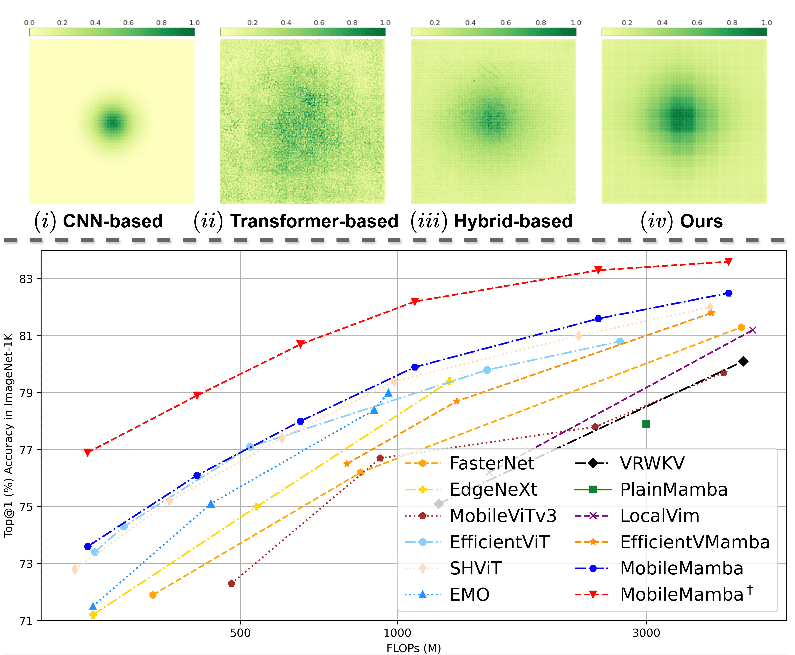
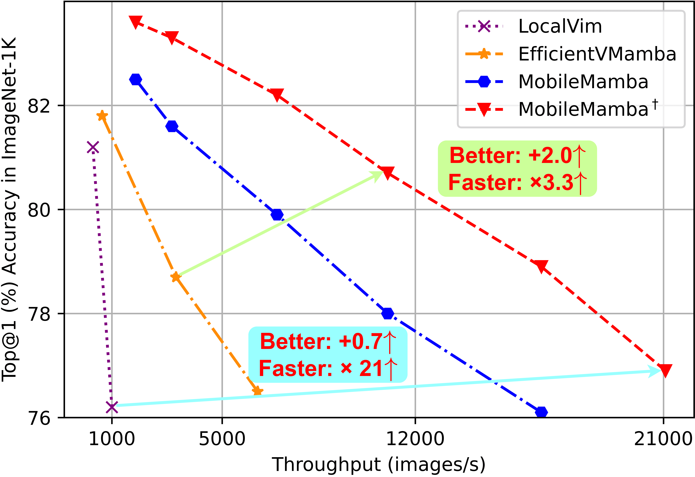

# MobileMamba

--- 
Official PyTorch implementation of "MobileMamba: Lightweight Multi-Receptive Visual Mamba Network".

[Haoyang He<sup>1*</sup>](https://scholar.google.com/citations?hl=zh-CN&user=8NfQv1sAAAAJ),
[Jiangning Zhang<sup>2*</sup>](https://zhangzjn.github.io),
[Yuxuan Cai<sup>3</sup>](https://scholar.google.com/citations?hl=zh-CN&user=J9lTFAUAAAAJ),
[Hongxu Chen<sup>1</sup>](https://scholar.google.com/citations?hl=zh-CN&user=uFT3YfMAAAAJ)
[Xiaobin Hu<sup>2</sup>](https://scholar.google.com/citations?hl=zh-CN&user=3lMuodUAAAAJ),

[Zhenye Gan<sup>2</sup>](https://scholar.google.com/citations?user=fa4NkScAAAAJ&hl=zh-CN),
[Yabiao Wang<sup>2</sup>](https://scholar.google.com/citations?user=xiK4nFUAAAAJ&hl=zh-CN),
[Chengjie Wang<sup>2</sup>](https://scholar.google.com/citations?hl=zh-CN&user=fqte5H4AAAAJ),
Yunsheng Wu<sup>2</sup>,
[Lei Xie<sup>1</sup>](https://scholar.google.com/citations?hl=zh-CN&user=7ZZ_-m0AAAAJ)

<sup>1</sup>College of Control Science and Engineering, Zhejiang University, 
<sup>2</sup>Youtu Lab, Tencent,
<sup>3</sup>Huazhong University of Science and Technology
> **Abstract:** Previous research on lightweight models has primarily focused on CNNs and Transformer-based designs. CNNs, with their local receptive fields, struggle to capture long-range dependencies, while Transformers, despite their global modeling capabilities, are limited by quadratic computational complexity in high-resolution scenarios. Recently, state-space models have gained popularity in the visual domain due to their linear computational complexity. Despite their low FLOPs, current lightweight Mamba-based models exhibit suboptimal throughput.
In this work, we propose the MobileMamba framework, which balances efficiency and performance. We design a three-stage network to enhance inference speed significantly. At a fine-grained level, we introduce the Multi-Receptive Field Feature Interaction MRFFI module, comprising the Long-Range Wavelet Transform-Enhanced Mamba WTE-Mamba, Efficient Multi-Kernel Depthwise Convolution MK-DeConv, and Eliminate Redundant Identity components. This module integrates multi-receptive field information and enhances high-frequency detail extraction. Additionally, we employ training and testing strategies to further improve performance and efficiency.
MobileMamba achieves up to 83.6% on Top-1, surpassing existing state-of-the-art methods which is maximum x21 faster than LocalVim on GPU. Extensive experiments on high-resolution downstream tasks demonstrate that MobileMamba surpasses current efficient models, achieving an optimal balance between speed and accuracy.

<div align="center">
  
</div>

> **Top**: Visualization of the *Effective Receptive Fields* (ERF) for different architectures. 
> **Bottom**: Performance *vs.* FLOPs with recent CNN/Transformer/Mamba-based methods.<br>

<div align="center">
  
</div>

> ***Accuracy*** *vs.* ***Speed*** with Mamba-based methods.

------
# Classification results
### Image Classification for [ImageNet-1K](https://www.image-net.org):
| Model                    | FLOPs | #Params | Resolution | Top-1 |                      Cfg                      |                        Log                         |                        Model                         |
|--------------------------|:-----:|:-------:|:----------:|:-----:|:---------------------------------------------:|:--------------------------------------------------:|:----------------------------------------------------:|
| MobileMamba-T2           | 255M  |  8.8M   | 192 x 192  | 71.5  | [cfg](configs/mobilemamba/mobilemamba_t2.py)  |  [log](weights/MobileMamba_T2/mobilemamba_t2.txt)  |  [model](weights/MobileMamba_T2/mobilemamba_t2.pth)  |
| MobileMamba-T2† | 255M  |  8.8M   | 192 x 192  | 76.9  | [cfg](configs/mobilemamba/mobilemamba_t2s.py) | [log](weights/MobileMamba_T2s/mobilemamba_t2s.txt) | [model](weights/MobileMamba_T2s/mobilemamba_t2s.pth) |
| MobileMamba-T4           | 413M  |  14.2M  | 192 x 192  | 76.1  | [cfg](configs/mobilemamba/mobilemamba_t4.py)  |  [log](weights/MobileMamba_T4/mobilemamba_t4.txt)  |  [model](weights/MobileMamba_T4/mobilemamba_t4.pth)  |
| MobileMamba-T4†          | 413M  |  14.2M  | 192 x 192  | 78.9  | [cfg](configs/mobilemamba/mobilemamba_t4s.py) | [log](weights/MobileMamba_T4s/mobilemamba_t4s.txt) | [model](weights/MobileMamba_T4s/mobilemamba_t4s.pth) |
| MobileMamba-S6           | 652M  |  15.0M  | 224 x 224  | 78.0  | [cfg](configs/mobilemamba/mobilemamba_s6.py)  |  [log](weights/MobileMamba_S6/mobilemamba_s6.txt)  |  [model](weights/MobileMamba_S6/mobilemamba_s6.pth)  |
| MobileMamba-S6†          | 652M  |  15.0M  | 224 x 224  | 80.7  | [cfg](configs/mobilemamba/mobilemamba_s6s.py) | [log](weights/MobileMamba_S6s/mobilemamba_s6s.txt) | [model](weights/MobileMamba_S6s/mobilemamba_s6s.pth) |
| MobileMamba-B1           | 1080M |  17.1M  | 256 x 256  | 79.9  | [cfg](configs/mobilemamba/mobilemamba_b1.py)  |  [log](weights/MobileMamba_B1/mobilemamba_b1.txt)  |  [model](weights/MobileMamba_B1/mobilemamba_b1.pth)  |
| MobileMamba-B1†          | 1080M |  17.1M  | 256 x 256  | 82.2  | [cfg](configs/mobilemamba/mobilemamba_b1s.py) | [log](weights/MobileMamba_B1s/mobilemamba_b1s.txt) | [model](weights/MobileMamba_B1s/mobilemamba_b1s.pth) |
| MobileMamba-B2           | 2427M |  17.1M  | 384 x 384  | 81.6  | [cfg](configs/mobilemamba/mobilemamba_b2.py)  |  [log](weights/MobileMamba_B2/mobilemamba_b2.txt)  |  [model](weights/MobileMamba_B2/mobilemamba_b2.pth)  |
| MobileMamba-B2†          | 2427M |  17.1M  | 384 x 384  | 83.3  | [cfg](configs/mobilemamba/mobilemamba_b2s.py) | [log](weights/MobileMamba_B2s/mobilemamba_b2s.txt) | [model](weights/MobileMamba_B2s/mobilemamba_b2s.pth) |
| MobileMamba-B4           | 4313M |  17.1M  | 512 x 512  | 82.5  | [cfg](configs/mobilemamba/mobilemamba_b4.py)  |  [log](weights/MobileMamba_B4/mobilemamba_b4.txt)  |  [model](weights/MobileMamba_B4/mobilemamba_b4.pth)  |
| MobileMamba-B4†          | 4313M |  17.1M  | 512 x 512  | 83.6  | [cfg](configs/mobilemamba/mobilemamba_b4s.py) | [log](weights/MobileMamba_B4s/mobilemamba_b4s.txt) | [model](weights/MobileMamba_B4s/mobilemamba_b4s.pth) |

# Downstream Results
## Object Detection and Instant Segmentation Results
### Object Detection  and Instant Segmentation Performance Based on [Mask-RCNN](https://openaccess.thecvf.com/content_ICCV_2017/papers/He_Mask_R-CNN_ICCV_2017_paper.pdf) for [COCO2017](https://cocodataset.org):
| Backbone | AP<sup>b</sup> | AP<sup>b</sup><sub>50</sub> | AP<sup>b</sup><sub>75</sub> | AP<sup>b</sup><sub>S</sub> | AP<sup>b</sup><sub>M</sub> | AP<sup>b</sup><sub>L</sub> | AP<sup>m</sup> | AP<sup>m</sup><sub>50</sub> | AP<sup>m</sup><sub>75</sub> | AP<sup>m</sup><sub>S</sub> | AP<sup>m</sup><sub>M</sub> | AP<sup>m</sup><sub>L</sub> | #Params | FLOPs |                    Cfg                     |                    Log                     |                    Model                     |
|:--------:|:--------------:|:---------------------------:|:---------------------------:|:--------------------------:|:--------------------------:|:--------------------------:|:--------------:|:---------------------------:|:---------------------------:|:--------------------------:|:--------------------------:|:--------------------------:|:-------:|:-----:|:------------------------------------------:|:------------------------------------------:|:--------------------------------------------:|
|  MobileMamba-B1  |      40.6      |            61.8             |            43.8             |            22.4            |            43.5            |            55.9            |      37.4      |            58.9             |            39.9             |            17.1            |            39.9            |            56.4            |  38.0M  | 178G  | [cfg](downstream/det/configs/mask_rcnn/mask-rcnn_mobilemamba_b1_fpn_1x_coco.py) | [log](weights/downstream/det/maskrcnn.log) | [model](weights/downstream/det/maskrcnn.pth) |

### Object Detection Performance Based on [RetinaNet](https://openaccess.thecvf.com/content_ICCV_2017/papers/Lin_Focal_Loss_for_ICCV_2017_paper.pdf) for [COCO2017](https://cocodataset.org):
| Backbone |  AP  | AP<sub>50</sub> | AP<sub>75</sub> | AP<sub>S</sub> | AP<sub>M</sub> | AP<sub>L</sub> | #Params | FLOPs |                     Cfg                     |                     Log                     |                     Model                     |
|:--------:|:----:|:---------------:|:---------------:|:--------------:|:--------------:|:--------------:|:-------:|:-----:|:-------------------------------------------:|:-------------------------------------------:|:---------------------------------------------:|
|  MobileMamba-B1  | 39.6 |      59.8       |      42.4       |      21.5      |      43.4      |      53.9      |  27.1M  | 151G  | [cfg](downstream/det/configs/retinanet/retinanet_mobilemamba_b1_fpn_1x_coco.py) | [log](weights/downstream/det/retinanet.log) | [model](weights/downstream/det/retinanet.pth) |

### Object Detection Performance Based on [SSDLite](https://openaccess.thecvf.com/content_ICCV_2019/papers/Howard_Searching_for_MobileNetV3_ICCV_2019_paper.pdf) for [COCO2017](https://cocodataset.org):
|      Backbone       |  AP  | AP<sub>50</sub> | AP<sub>75</sub> | AP<sub>S</sub> | AP<sub>M</sub> | AP<sub>L</sub> | #Params | FLOPs |                                      Cfg                                      |              Log               |                      Model                      |
|:-------------------:|:----:|:---------------:|:---------------:|:--------------:|:--------------:|:--------------:|:-------:|:-----:|:-----------------------------------------------------------------------------:|:------------------------------:|:-----------------------------------------------:|
|   MobileMamba-B1    | 24.0 |      39.5       |      24.0       |      3.1       |      23.4      |      46.9      |  18.0M  | 1.7G  |   [cfg](downstream/det/configs/ssd/ssdlite_mobilemamba_b1_8gpu_2lr_coco.py)   |   [log](weights/downstream/det/ssdlite.log)   |   [model](weights/downstream/det/ssdlite.pth)   |
| MobileMamba-B1-r512 | 29.5 |      47.7       |      30.4       |      8.9       |      35.0      |      47.0      |  18.0M  | 4.4G  | [cfg](downstream/det/configs/ssd/ssdlite_mobilemamba_b1_8gpu_2lr_512_coco.py) | [log](weights/downstream/det/ssdlite_512.log) | [model](weights/downstream/det/ssdlite_512.pth) |

## Semantic Segmentation Results
### Semantic Segmentation Based on [Semantic FPN](https://openaccess.thecvf.com/content_CVPR_2019/papers/Kirillov_Panoptic_Feature_Pyramid_Networks_CVPR_2019_paper.pdf) for [ADE20k](http://sceneparsing.csail.mit.edu/):
| Backbone | aAcc | mIoU | mAcc | #Params | FLOPs |                  Cfg                  |                  Log                  |                  Model                  |
|:--------:|:----:|:----:|:----:|:-------:|:-----:|:-------------------------------------:|:-------------------------------------:|:---------------------------------------:|
| MobileMamba-B4 | 79.9 | 42.5 | 53.7 |  19.8M  | 5.6G  | [cfg](downstream/seg/configs/sem_fpn/fpn_mobilemamba_b4-160k_ade20k-512x512.py) | [log](weights/downstream/seg/fpn.log) | [model](weights/downstream/seg/fpn.pth) |


### Semantic Segmentation Based on [DeepLabv3](https://arxiv.org/pdf/1706.05587.pdf) for [ADE20k](http://sceneparsing.csail.mit.edu/):
|    Backbone    | aAcc | mIoU | mAcc | #Params | FLOPs |                     Cfg                     |                     Log                     |                     Model                     |
|:--------------:|:----:|:----:|:----:|:-------:|:-----:|:-------------------------------------------:|:-------------------------------------------:|:---------------------------------------------:|
| MobileMamba-B4 | 76.3 | 36.6 | 47.1 |  23.4M  | 4.7G  | [cfg](downstream/seg/configs/deeplabv3/deeplabv3_mobilemamba_b4-80k_ade20k-512x512.py) | [log](weights/downstream/seg/deeplabv3.log) | [model](weights/downstream/seg/deeplabv3.pth) |


### Semantic Segmentation Based on [PSPNet](https://openaccess.thecvf.com/content_cvpr_2017/papers/Zhao_Pyramid_Scene_Parsing_CVPR_2017_paper.pdf) for [ADE20k](http://sceneparsing.csail.mit.edu/):
| Backbone | aAcc | mIoU | mAcc | #Params | FLOPs |                   Cfg                    |                   Log                    |                   Model                    |
|:--------:|:----:|:----:|:----:|:-------:|:-----:|:----------------------------------------:|:----------------------------------------:|:------------------------------------------:|
| MobileMamba-B4 | 76.2 | 36.9 | 47.9 |  20.5M  | 4.5G  | [cfg](downstream/seg/configs/pspnet/pspnet_mobilemamba_b4-80k_ade20k-512x512.py) | [log](weights/downstream/seg/pspnet.log) | [model](weights/downstream/seg/pspnet.pth) |

------
# All Pretrained Weights and Logs

The model weights and log files for all classification and downstream tasks are available for download via [**weights**](https://drive.google.com/file/d/1EDqWI6JKMaLZRSRWt9aM7VXaNvosStGE/view?usp=drive_link).

------
# Classification
## Environments
```shell
pip3 install torch==2.1.2 torchvision==0.16.2 torchaudio==2.1.2 --index-url https://download.pytorch.org/whl/cu118
pip3 install timm==0.6.5 tensorboardX einops torchprofile fvcore==0.1.5.post20221221 
cd model/lib_mamba/kernels/selective_scan && pip install . && cd ../../../..
git clone https://github.com/NVIDIA/apex && cd apex && pip3 install -v --disable-pip-version-check --no-cache-dir --global-option="--cpp_ext" --global-option="--cuda_ext" ./ (optional)
```
  
## Prepare ImageNet-1K Dataset
Download and extract [ImageNet-1K](http://image-net.org/) dataset in the following directory structure:

```
├── imagenet
    ├── train
        ├── n01440764
            ├── n01440764_10026.JPEG
            ├── ...
        ├── ...
    ├── train.txt (optional)
    ├── val
        ├── n01440764
            ├── ILSVRC2012_val_00000293.JPEG
            ├── ...
        ├── ...
    └── val.txt (optional)
```

## Test
Test with 8 GPUs in one node:

<details>
<summary>
MobileMamba-T2
</summary>

```
python3 -m torch.distributed.launch --nproc_per_node=8 --nnodes=1 --use_env run.py -c configs/mobilemamba/mobilemamba_t2 -m test model.model_kwargs.checkpoint_path=weights/MobileMamba_T2/mobilemamba_t2.pth
```
This should give `Top-1: 73.638 (Top-5: 91.422)` 
</details>

<details>
<summary>
MobileMamba-T2†
</summary>

```
python3 -m torch.distributed.launch --nproc_per_node=8 --nnodes=1 --use_env run.py -c configs/mobilemamba/mobilemamba_t2s -m test model.model_kwargs.checkpoint_path=weights/MobileMamba_T2s/mobilemamba_t2s.pth
```
This should give `Top-1: 76.934 (Top-5: 93.100)` 
</details>

<details>
<summary>
MobileMamba-T4
</summary>

```
python3 -m torch.distributed.launch --nproc_per_node=8 --nnodes=1 --use_env run.py -c configs/mobilemamba/mobilemamba_t4 -m test model.model_kwargs.checkpoint_path=weights/MobileMamba_T4/mobilemamba_t4.pth
```
This should give `Top-1: 76.086 (Top-5: 92.772)` 
</details>

<details>
<summary>
MobileMamba-T4†
</summary>

```
python3 -m torch.distributed.launch --nproc_per_node=8 --nnodes=1 --use_env run.py -c configs/mobilemamba/mobilemamba_t4s -m test model.model_kwargs.checkpoint_path=weights/MobileMamba_T4s/mobilemamba_t4s.pth
```
This should give `Top-1: 78.914 (Top-5: 94.160)` 
</details>

<details>
<summary>
MobileMamba-S6
</summary>

```
python3 -m torch.distributed.launch --nproc_per_node=8 --nnodes=1 --use_env run.py -c configs/mobilemamba/mobilemamba_s6 -m test model.model_kwargs.checkpoint_path=weights/MobileMamba_S6/mobilemamba_s6.pth
```
This should give `Top-1: 78.002 (Top-5: 93.992)` 
</details>

<details>
<summary>
MobileMamba-S6†
</summary>

```
python3 -m torch.distributed.launch --nproc_per_node=8 --nnodes=1 --use_env run.py -c configs/mobilemamba/mobilemamba_s6s -m test model.model_kwargs.checkpoint_path=weights/MobileMamba_S6s/mobilemamba_s6s.pth
```
This should give `Top-1: 80.742 (Top-5: 95.182)` 
</details>

<details>
<summary>
MobileMamba-B1
</summary>

```
python3 -m torch.distributed.launch --nproc_per_node=8 --nnodes=1 --use_env run.py -c configs/mobilemamba/mobilemamba_b1 -m test model.model_kwargs.checkpoint_path=weights/MobileMamba_B1/mobilemamba_b1.pth
```
This should give `Top-1: 79.948 (Top-5: 94.924)` 
</details>

<details>
<summary>
MobileMamba-B1†
</summary>

```
python3 -m torch.distributed.launch --nproc_per_node=8 --nnodes=1 --use_env run.py -c configs/mobilemamba/mobilemamba_b1s -m test model.model_kwargs.checkpoint_path=weights/MobileMamba_B1s/mobilemamba_b1s.pth
```
This should give `Top-1: 82.234 (Top-5: 95.872)` 
</details>

<details>
<summary>
MobileMamba-B2
</summary>

```
python3 -m torch.distributed.launch --nproc_per_node=8 --nnodes=1 --use_env run.py -c configs/mobilemamba/mobilemamba_b2 -m test model.model_kwargs.checkpoint_path=weights/MobileMamba_B2/mobilemamba_b2.pth
```
This should give `Top-1: 81.624 (Top-5: 95.890)` 
</details>

<details>
<summary>
MobileMamba-B2†
</summary>

```
python3 -m torch.distributed.launch --nproc_per_node=8 --nnodes=1 --use_env run.py -c configs/mobilemamba/mobilemamba_b2s -m test model.model_kwargs.checkpoint_path=weights/MobileMamba_B2s/mobilemamba_b2s.pth
```
This should give `Top-1: 83.260 (Top-5: 96.438)` 
</details>

<details>
<summary>
MobileMamba-B4
</summary>

```
python3 -m torch.distributed.launch --nproc_per_node=8 --nnodes=1 --use_env run.py -c configs/mobilemamba/mobilemamba_b4 -m test model.model_kwargs.checkpoint_path=weights/MobileMamba_B4/mobilemamba_b4.pth
```
This should give `Top-1: 82.496 (Top-5: 96.252)` 
</details>

<details>
<summary>
MobileMamba-B4†
</summary>

```
python3 -m torch.distributed.launch --nproc_per_node=8 --nnodes=1 --use_env run.py -c configs/mobilemamba/mobilemamba_b4s -m test model.model_kwargs.checkpoint_path=weights/MobileMamba_B4s/mobilemamba_b4s.pth
```
This should give `Top-1: 83.644 (Top-5: 96.606)` 
</details>


## Train
Train with 8 GPUs in one node:

<details>
<summary>
MobileMamba-T2
</summary>

```
python3 -m torch.distributed.launch --nproc_per_node=8 --nnodes=1 --use_env run.py -c configs/mobilemamba/mobilemamba_t2 -m train
```
</details>

<details>
<summary>
MobileMamba-T2†
</summary>

```
python3 -m torch.distributed.launch --nproc_per_node=8 --nnodes=1 --use_env run.py -c configs/mobilemamba/mobilemamba_t2s -m train
```
</details>

<details>
<summary>
MobileMamba-T4
</summary>

```
python3 -m torch.distributed.launch --nproc_per_node=8 --nnodes=1 --use_env run.py -c configs/mobilemamba/mobilemamba_t4 -m train
```
</details>

<details>
<summary>
MobileMamba-T4†
</summary>

```
python3 -m torch.distributed.launch --nproc_per_node=8 --nnodes=1 --use_env run.py -c configs/mobilemamba/mobilemamba_t4s -m train
```
</details>

<details>
<summary>
MobileMamba-S6
</summary>

```
python3 -m torch.distributed.launch --nproc_per_node=8 --nnodes=1 --use_env run.py -c configs/mobilemamba/mobilemamba_s6 -m train
```
</details>

<details>
<summary>
MobileMamba-S6†
</summary>

```
python3 -m torch.distributed.launch --nproc_per_node=8 --nnodes=1 --use_env run.py -c configs/mobilemamba/mobilemamba_s6s -m train
```
</details>

<details>
<summary>
MobileMamba-B1
</summary>

```
python3 -m torch.distributed.launch --nproc_per_node=8 --nnodes=1 --use_env run.py -c configs/mobilemamba/mobilemamba_b1 -m train
```
</details>

<details>
<summary>
MobileMamba-B1†
</summary>

```
python3 -m torch.distributed.launch --nproc_per_node=8 --nnodes=1 --use_env run.py -c configs/mobilemamba/mobilemamba_b1s -m train
```
</details>

<details>
<summary>
MobileMamba-B2
</summary>

```
python3 -m torch.distributed.launch --nproc_per_node=8 --nnodes=1 --use_env run.py -c configs/mobilemamba/mobilemamba_b2 -m train
```
</details>

<details>
<summary>
MobileMamba-B2†
</summary>

```
python3 -m torch.distributed.launch --nproc_per_node=8 --nnodes=1 --use_env run.py -c configs/mobilemamba/mobilemamba_b2s -m train
```
</details>

<details>
<summary>
MobileMamba-B4
</summary>

```
python3 -m torch.distributed.launch --nproc_per_node=8 --nnodes=1 --use_env run.py -c configs/mobilemamba/mobilemamba_b4 -m train
```
</details>

<details>
<summary>
MobileMamba-B4†
</summary>

```
python3 -m torch.distributed.launch --nproc_per_node=8 --nnodes=1 --use_env run.py -c configs/mobilemamba/mobilemamba_b4s -m train
```
</details>

------
# Down-Stream Tasks
## Environments
```shell
pip3 install terminaltables pycocotools prettytable xtcocotools
pip3 install mmpretrain==1.2.0 mmdet==3.3.0 mmsegmentation==1.2.2
pip3 install mmcv==2.1.0 -f https://download.openmmlab.com/mmcv/dist/cu118/torch2.1/index.html
cd det/backbones/lib_mamba/kernels/selective_scan && pip install . && cd ../../../..
```
## Prepare COCO and ADE20k Dataset
Download and extract [COCO2017](https://cocodataset.org) and [ADE20k](http://sceneparsing.csail.mit.edu/) dataset in the following directory structure:

```
downstream
├── det
├──── data
│   ├──── coco
│   │   ├──── annotations
│   │   ├──── train2017
│   │   ├──── val2017
│   │   ├──── test2017
├── seg
├──── data
│   ├──── ade
│   │   ├──── ADEChallengeData2016
│   │   ├──────── annotations
│   │   ├──────── images
```

## Object Detection
<details>
<summary>
Mask-RCNN
</summary>

#### Train:

```
CUDA_VISIBLE_DEVICES=0,1,2,3 ./tools/dist_train.sh configs/mask_rcnn/mask-rcnn_mobilemamba_b1_fpn_1x_coco.py 4
```

#### Test:

```
CUDA_VISIBLE_DEVICES=0,1,2,3 ./tools/dist_test.sh configs/mask_rcnn/mask-rcnn_mobilemamba_b1_fpn_1x_coco.py ../../weights/downstream/det/maskrcnn.pth 4
```
</details>

<details>
<summary>
RetinaNet
</summary>

#### Train:

```
CUDA_VISIBLE_DEVICES=0,1,2,3 ./tools/dist_train.sh configs/retinanet/retinanet_mobilemamba_b1_fpn_1x_coco.py 4
```

#### Test:

```
CUDA_VISIBLE_DEVICES=0,1,2,3 ./tools/dist_test.sh configs/retinanet/retinanet_mobilemamba_b1_fpn_1x_coco.py ../../weights/downstream/det/retinanet.pth 4
```
</details>

<details>
<summary>
SSDLite
</summary>

#### Train with 320 x 320 resolution:

```
./tools/dist_train.sh configs/ssd/ssdlite_mobilemamba_b1_8gpu_2lr_coco.py 8
```

#### Test with 320 x 320 resolution:

```
./tools/dist_test.sh configs/ssd/ssdlite_mobilemamba_b1_8gpu_2lr_coco.py ../../weights/downstream/det/ssdlite.pth 8
```

#### Train with 512 x 512 resolution:
```
./tools/dist_train.sh configs/ssd/ssdlite_mobilemamba_b1_8gpu_2lr_512_coco.py 8
```

#### Test with 512 x 512 resolution:

```
./tools/dist_test.sh configs/ssd/ssdlite_mobilemamba_b1_8gpu_2lr_512_coco.py ../../weights/downstream/det/ssdlite_512.pth 8
```
</details>


## Semantic Segmentation
<details>
<summary>
DeepLabV3
</summary>

#### Train:

```
CUDA_VISIBLE_DEVICES=0,1,2,3 ./tools/dist_train.sh configs/deeplabv3/deeplabv3_mobilemamba_b4-80k_ade20k-512x512.py 4
```

#### Test:

```
CUDA_VISIBLE_DEVICES=0,1,2,3 ./tools/dist_test.sh configs/deeplabv3/deeplabv3_mobilemamba_b4-80k_ade20k-512x512.py ../../weights/downstream/seg/deeplabv3.pth 4
```
</details>

<details>
<summary>
Semantic FPN
</summary>

#### Train:

```
CUDA_VISIBLE_DEVICES=0,1,2,3 ./tools/dist_train.sh configs/sem_fpn/fpn_mobilemamba_b4-160k_ade20k-512x512.py 4
```

#### Test:

```
CUDA_VISIBLE_DEVICES=0,1,2,3 ./tools/dist_test.sh configs/sem_fpn/fpn_mobilemamba_b4-160k_ade20k-512x512.py ../../weights/downstream/seg/fpn.pth 4
```
</details>

<details>
<summary>
PSPNet
</summary>

#### Train:

```
CUDA_VISIBLE_DEVICES=0,1,2,3 ./tools/dist_train.sh configs/pspnet/pspnet_mobilemamba_b4-80k_ade20k-512x512.py 4
```

#### Test:

```
CUDA_VISIBLE_DEVICES=0,1,2,3 ./tools/dist_test.sh configs/pspnet/pspnet_mobilemamba_b4-80k_ade20k-512x512.py ../../weights/downstream/seg/pspnet.pth 4
```
</details>


## Citation
If our work is helpful for your research, please consider citing:
```angular2html
@article{mobilemamba,
  title={MobileMamba: Lightweight Multi-Receptive Visual Mamba Network},
  author={Haoyang He and Jiangning Zhang and Yuxuan Cai and Hongxu Chen and Xiaobin Hu and Zhenye Gan and Yabiao Wang and Chengjie Wang and Yunsheng Wu and Lei Xie},
  journal={arXiv preprint},
  year={2024}
}
```

# Acknowledgements
We thank but not limited to following repositories for providing assistance for our research:
- [EMO](https://github.com/zhangzjn/EMO)
- [VMamba](https://github.com/MzeroMiko/VMamba)
- [TIMM](https://github.com/rwightman/pytorch-image-models)
- [MMDetection](https://github.com/open-mmlab/mmdetection)
- [MMSegmentation](https://github.com/open-mmlab/mmsegmentation)


